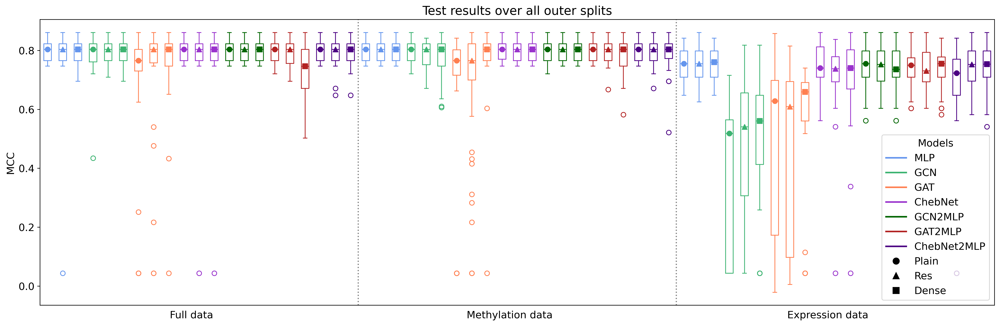

# Benchmarking Graph Neural Networks for Multi-Omics Cancer Subtyping using Methylation and Gene Expression Profiles
*Julia Schirmacher, Miriam C. Maurer, Jacqueline M. Metsch, Hryhorii Chereda, David B. Blumenthal and Anne-Christin Hauschild*


## Overview
This code and data are part of the paper "Benchmarking Graph Neural Networks for Multi-Omics Cancer Subtyping using
Methylation and Gene Expression Profiles".
A benchmark of Graph Neural Network methods on a PPI network on gene expression and methylation data for cancer 
classification is implemented.

## Abstract
**Motivation:** Graph Neural Networks (GNNs) have gained increasing interest in the biomedical domain,
as the integration of prior knowledge and deep neural networks has the potential to enhance insights into
molecular processes and disease mechanisms. However, a comprehensive and systematic assessment of model
architectures, data modalities, graph structures, and their performance for graph signal classification in the
biomedical domain is yet to be performed. In order to close this gap, we conducted a benchmarking study on
multiple GNNs on a Protein-Protein Interaction (PPI) network for cancer prediction, performing an in-depth
investigation of architectures, incorporating skip connections and various data modalities.


**Results:** While none of the GNNs outperforms the structure-agnostic Multi-Layer Perceptron baseline,
all of them can handle bimodal data (gene methylation and expression) and offer the ability to gain
explainability based on PPIs. We offer practical guidelines for applying GNNs to graph signal processing
tasks specifically for cancer classification. Models based on multi-omics or methylation data outperform
models solely incorporating gene expression data for this task. Overall, we suggest using ChebNet as it tends
to outperform the Graph Convolutional Network and the Graph Attention Network in subtype prediction and
cancer classification in general. We recommend using GNN architectures that employ a simple flattening
readout layer as such architectures provide better classification performance and faster training time than
those with global average pooling readout. Additionally, we tested residual and skip connections, but they
had only an insignificant impact on classification performance.

Contact: julia.schirmacher@med.uni-goettingen.de, anne-christin.hauschild@uni-gießen.de

## Results


## Dataset
The dataset contain patient-specific methylation and gene expression data matched with the universal graph structure 
from STRING PPI.
It follows Pfeifer et al. (2022) and Metsch et al. (2024) and is downloaded via 
http://rshiny.gwdg.de/apps/clarus/datasets.zip . For more details, see the paper.
The dataset, additional preprocessing/preparation steps as well as the (for reproducibility and fairness) precomputed
data splits can be found in the directory *data*.
In addition, the underlying data splitting script can be found under *data_splitting.py*.  The dataset class definition 
can be found in *data.py*.

## Models
The examined models are a MLP, GCN, GAT and ChebNet (without additional graph coarsening/pooling), see the paper.
Additionally, those have options/additionally defined models for adding residual or dense connections (Res/Dense) and 
flattening readout ("2MLP") instead of standard global average pooling.
The models are defined in *gnn_models.py*.

## Environment
To ensure a reproducible setting, a conda environment is used. It can be recreated via the `conda_requirements.txt` or 
`conda_requirements.yaml`.
The latter one is the recommended way of set up the used environment.

## Benchmark procedure
The benchmark is performed on a nested data splitting scheme, including outer splits for model assessment and an inner
splits for model selection. For more details, see the paper.
This and the whole evaluation setup can be found in *operator_run_ray.py* and *operator_run_ray_testruns.py* (using 
helper functions defined in *callbacks.py* and *process_results.py*)
The latter one applies one separate test split for the seek of pretesting aiming in reducing the hyperparamter grid
(from 5 to 3 choices per hyperparameter). After running this, the narrowed hyperparameter grid can be defined 
and the final evaluation can be run. Both, the configuration for the pretest and the final configuration for every model
are defined in the directory *configs_pretest* and *configs*.

The whole evaluation is set up to run on GPU nodes on a HPC cluster with slurm and thus, *ray tune* and *ray train* is 
employed and a sbatch script is included.
The final evaluation script can be run via *launch_job_ray.py*, which itself uses *job_ray_template.sh*. 
This can be adapted due to specific architectural choices.

To run the final evaluation, use `operator_run_ray.py` via:
```
python launch_job_ray.py --exp-name ExperimentName --command "python -u operator_run_ray.py configs/model_config.py" --num-gpus number --num-nodes number --partition partition_name --node node_name
```
For the pretests, the procedure is conducted analogously with `operator_run_ray_testruns.py` and `configs_test`.

This produces *result_inner** result files corresponding to the inner splits in the data splitting scheme and 
*result_outer** for the outer splits, i.e. the final test splits. Several detailed result tables are provided.

## Result analysis
For the result analysis, several jupyter notebooks for visualization and statistical analysis can be found in the
directory *evaluation*. *Pretest_figures_KIRC.ipynb* is used for the result analyses of the pretest results. These built
the decision basis for narrowing down the hyperparameter grid for the final runs. 

## License
This work is licensed under a CC BY-NC 4.0 License.


## Copyright
<p style="margin-left:40px;">
  
  &nbsp;&nbsp;&nbsp;&nbsp;&nbsp;&nbsp;&nbsp;&nbsp;&nbsp;&nbsp;
  &nbsp;&nbsp;&nbsp;&nbsp;&nbsp;&nbsp;&nbsp;&nbsp;&nbsp;&nbsp;
  &nbsp;&nbsp;&nbsp;&nbsp;&nbsp;&nbsp;&nbsp;&nbsp;&nbsp;&nbsp;
  &nbsp;&nbsp;&nbsp;&nbsp;&nbsp;&nbsp;&nbsp;&nbsp;
  
</p>

<p style="margin-left:40px;">
  
  &nbsp;&nbsp;&nbsp;&nbsp;&nbsp;&nbsp;&nbsp;&nbsp;&nbsp;&nbsp;
  &nbsp;&nbsp;&nbsp;&nbsp;&nbsp;&nbsp;&nbsp;&nbsp;&nbsp;&nbsp;
  
</p>

## Acknowledgement
The results shown here are in part based upon data generated by the TCGA Research Network: 
https://www.cancer.gov/tcga.
This work is supported in part by funds from the German Ministry of Education and Research (BMBF) under grant agreements
No. 01KD2208A and No. 01KD2414A (project FAIrPaCT).
We gratefully acknowledge the computing time granted by the Resource Allocation Board and provided on the supercomputer 
Emmy/Grete at NHR@Göttingen as part of the NHR infrastructure, under the project *nib00044* and *nim00014*.
In part funded by the Deutsche Forschungsgemeinschaft (DFG, German Research Foundation) – 405797229. In part this work 
is funded by the Bavarian State Ministry of Science and the Arts in the framework of the bidt Graduate Center for Postdocs.
